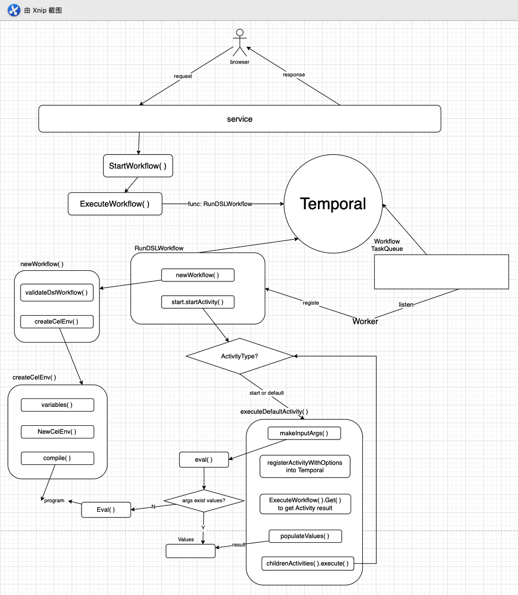
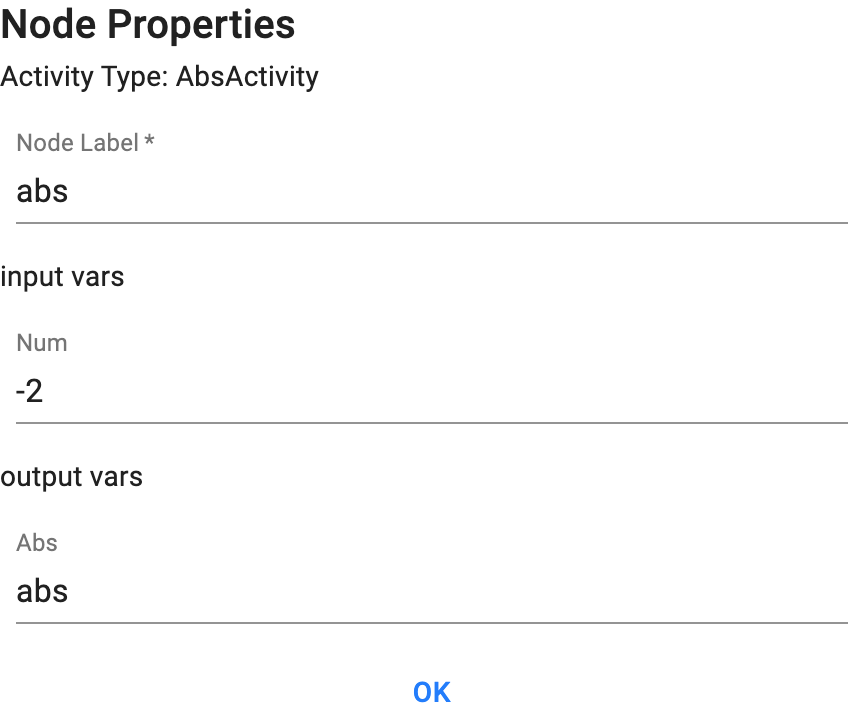
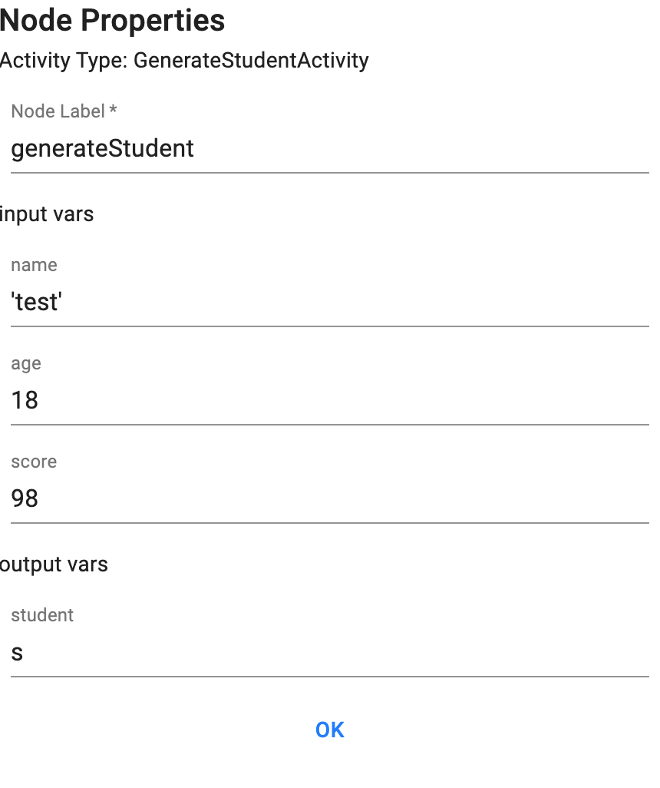
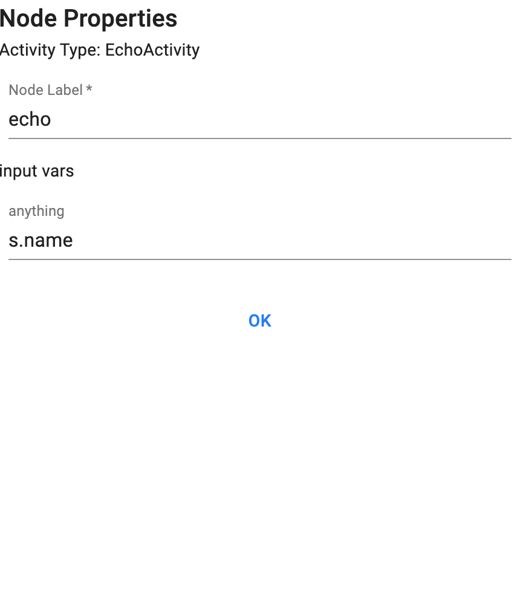

# df workflow

## Directory structure

```bash
.
├── Makefile
├── README.md
├── advisor								# Provide df-loading notification function
├── docs									# Project description document
├── go.mod								# go dependencies
├── helper								# helper logger
├── internal							# Basic functions (tools) within the project
│   ├── auth						 # User authenticator
│   ├── env							 # Load the project configuration file (.env)
│   ├── errors					 # encapsulation of error
│   ├── logging						# encapsulation of logrus
│   ├── tmdur							# encapsulation of time duration
│   ├── uid								# Operations on Uuid, such as creating Uuid
│   └── wfltest						# easy to test
├── main.go								# entry
├── rule									# Data validation rules
├── service								# business（including grpc server and workflow operations）
├── storage								# data persistence layer
├── testdata							# test data
├── worker								# worker
└── workflow							# workflow
```

## Package workflow

```bash
./workflow/
├── activities						# Built-in Activities
├── cel.go								# encapsulation of cel-go
├── common								# public components (such as constants)
├── converter.go					# data type conversion
├── dsl.go								# DSLWorkflow
├── engine.go							# workflow business
├── execute.go						# General execution logic of Activities in workflow
├── group.go							# General grouping logic of Activities in workflow
├── registar.go						# The interface for registering Activity
├── sideffect.go					# uuid
├── temporalclient.go			# client of Temporal
├── temporalerror.go			# errors of Temporal
├── wire.go								# dependency injection
├── wire_gen.go						# wire generated
└── worker.go							# DSLWorker
```

## Technology stack

### data communication layer

- [gRPC](https://grpc.io/)：Solve RPC communication
- [protobuf](https://developers.google.com/protocol-buffers)：Data transfer method required by gRPC
- [gRPC-web](https://grpc.io/blog/grpc-web-ga/)：Using gRPC on the web front end

### business Layer

- [wire](https://github.com/google/wire)：Implement dependency injection
- [Temporal](https://github.com/temporalio/temporal)：Handling the execution of workflow and activities

### database

- redis
- postgreSQL

### data processing

- [cel-go](https://github.com/google/cel-go)：Parse the typed expression

### log

- logrus

### test

- testify

## functional module

### models

**activity_model.proto** is the activity template model(like **parameters** in functions), it also defines the activity execution time timeout, heartbeat timeout, planned end time, retry strategy, etc.

**flow_model.proto** is the workflow panel model, contains the actual incoming data of each activity(like **argments** in functions), It also includes the two-dimensional position handled by the activity in the panel, the name of the activity, the input parameter list and output, and the side information connecting the two **activities**

> Tips
>
> parameter and argument
>
> The term parameter is used to describe the names for values that are expected to be supplied. 
>
> The term argument is used for the values provided for each parameter.

### business remote call

Use gRPC to implement remote business calls. Define the request and response of the related business in the workflow.proto specification, and then use gRPC to initiate the call.

### data persistence

edis uses go-redis to operate

postgres uses golang native sql to operate

### register workflow

The registration of the workflow in the project follows the temporal go sdk usage specification. First create the temporal client, then create the worker (specify the taskQueue monitored by the worker), and finally register the workflow with the worker (the taskQueue of the worker and the workflow need to correspond)

### register activities

The registration of the activities in the project follows the temporal go sdk usage specification. First create the temporal client, then create the worker (specify the taskQueue monitored by the worker), and finally specify the taskQueue in the flow when the activity is executed in the flow (the same as when the activity was registered). That is, the taskQueue monitored by the worker must be the same as the taskQueue when actvitiy was registered.

### Execution of workflow

The action of Run Workflow from the browser calls `StartWorkflow( )`, get workflowId、workflowUuid、workflow panel data，and initValues of the workflow。According to Temporal go sdk about [execute workflow](https://docs.temporal.io/docs/go/how-to-spawn-a-workflow-execution-in-go), the StartWorkflowOptions、the funcname of the executed workflow、the parameters in executing the workflow need to be specified.

The execution of the real workflow should be in the `RunDSLWorkflow()` function.

In the  `RunDSLWorkflow()` ,  first will call `newWorkflow()`to initialize workflow, but before Initialization of workflow will check  number of startActivity and number of endActivity.  During workflow initialization, will use cel-go to perform expression parse on Template input and panel output of the current Activity and all its ancestors, so far the workflow initialization is complete.

After initializing workflow in the  `RunDSLWorkflow()`, Immediately execute startActivity. 

Activity execution is a recursive process: first judge type of Activity, if its start or default, the  `makeInputArgs()`will try to get the parameters required by the current Activity from the result set(values) from ancestors Activity, if not found, then will use cel-go's Eval() to parse expressions. Then the Activity will be registered in Temporal, give it to Temporal to execute and get the execution result, finally populate the result into the result set(values), after that repeat the process for childrenActivity.



### Execution order of activities

TODO

### Simple expression parsing

It means parsing the panel input of workflow, for example:



`"-2"` is what needs to be parsed. Use cel-go to parse `"-2"` into a numeric type thay can be used. 

### Complex expression parsing

Simple expression parsing covers some basic data type parsing, but workflow can still parse things like `obj.field`（object.property）



As the picture shows, use `s.name` can get property of `s`(obj)

### Implementation of joinActivity

TODO