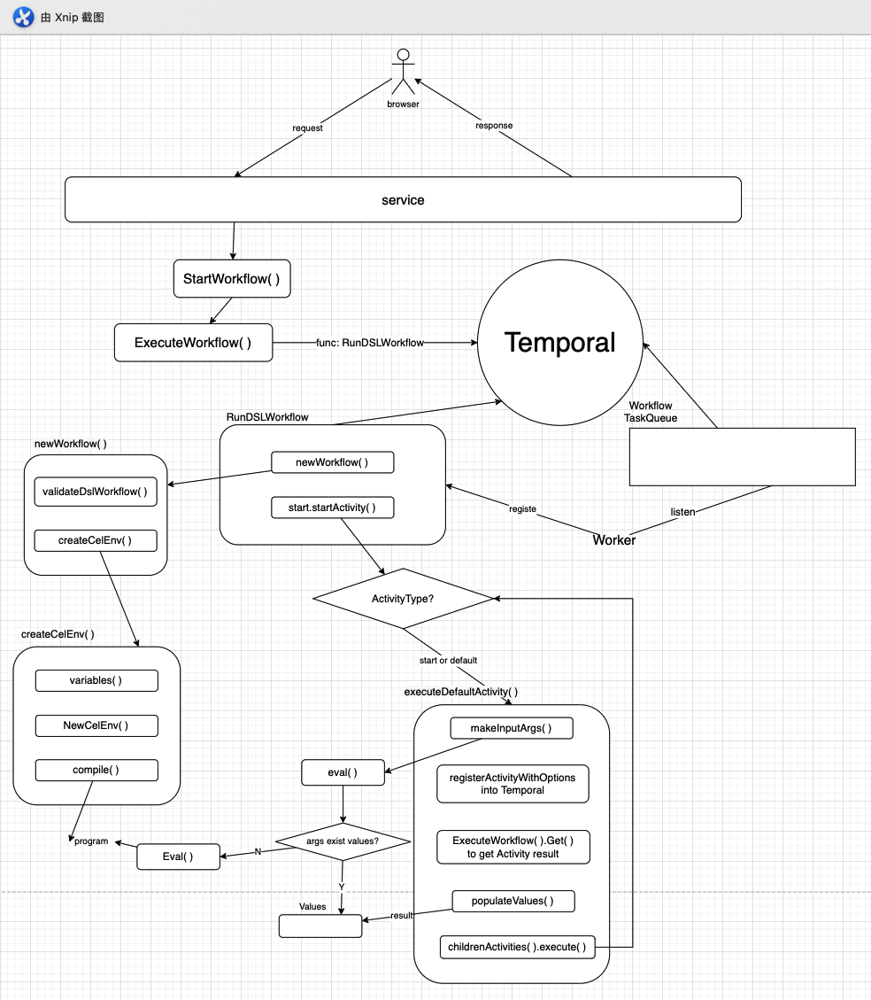
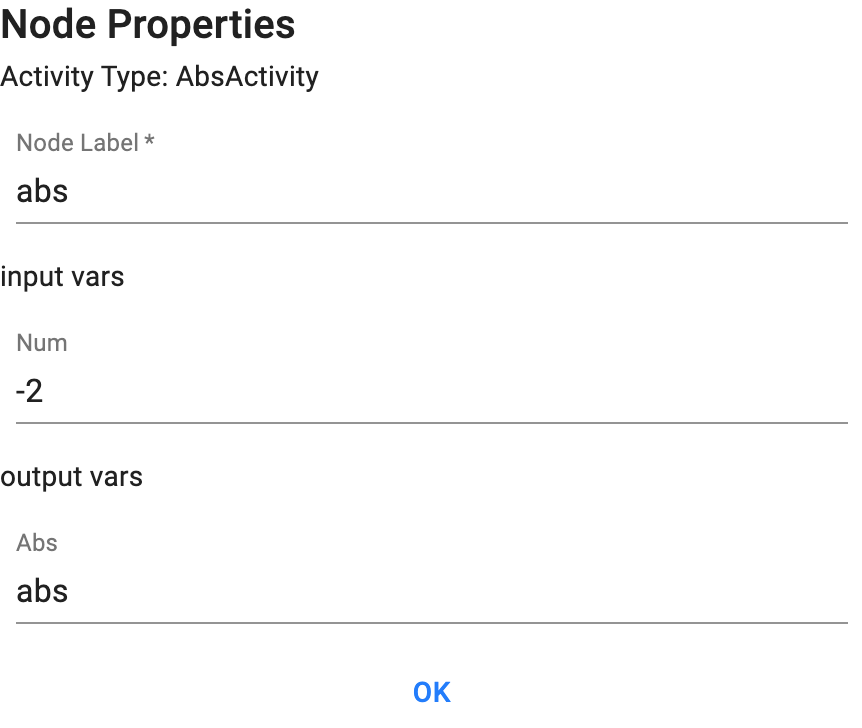
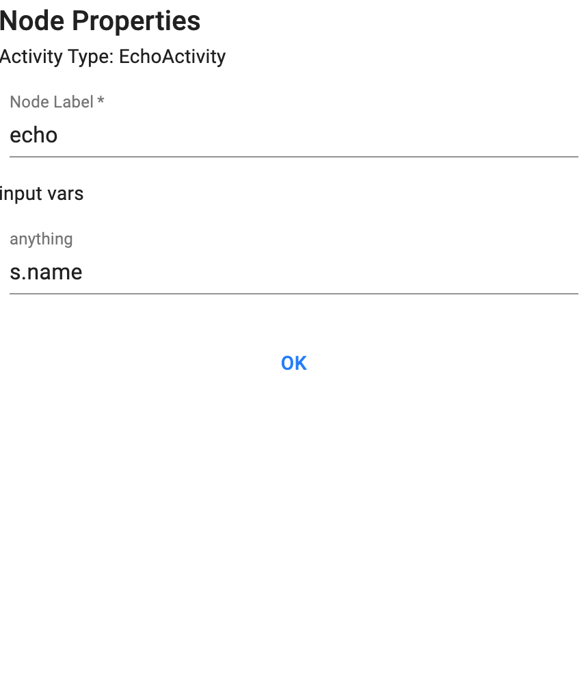

# df workflow

## 目录结构

```sh
.
├── Makefile
├── README.md
├── advisor								# 提供 df-loading 通知功能
├── docs									# 项目总体的描述文档
├── go.mod								# go依赖
├── helper								# helper logger
├── internal							# 项目内部的基础功能（工具）
│   ├── auth						 # 用户认证相关，包含UserInfo的模型	
│   ├── env							 # 对项目配置文件（.env）进行加载
│   ├── errors					 # 对error进行的封装
│   ├── logging						# 对logur日志的封装
│   ├── tmdur							# time duration的封装
│   ├── uid								# 对Uuid的操作，比如创建Uuid
│   └── wfltest						# 方便test测试
├── main.go								# 程序运行的入口
├── rule									# 数据的相关验证规则
├── service								# 业务（包含grpc的server、workflow的操作）
├── storage								# 数据的持久化层
├── testdata							# 测试的数据
├── worker								# worker
└── workflow							# workflow
```

## workflow包

```sh
./workflow/
├── activities						# 内置的Activities
├── cel.go								# cel-go的封装
├── common								# 公共组件（如常量等）
├── converter.go					# 数据类型转换
├── dsl.go								# DSLWorkflow
├── engine.go							# workflow的业务
├── execute.go						# workflow中Activities的通用执行逻辑
├── group.go							# workflow中Activities的通用分组逻辑
├── registar.go						# 注册Activity的接口
├── sideffect.go					# uuid
├── temporalclient.go			# temporal的client 
├── temporalerror.go			# temporal的errors
├── wire.go								# dependency inject
├── wire_gen.go						# wire自动生成
└── worker.go							# DSLWorker
```

## 技术栈

### 数据通信层

- [gRPC](https://grpc.io/)：解决RPC通信
- [protobuf](https://developers.google.com/protocol-buffers)：gRPC所需要的数据传输方式
- [gRPC-web](https://grpc.io/blog/grpc-web-ga/)：在web前端使用gRPC

### 业务层

- [wire](https://github.com/google/wire)：实现依赖注入
- [Temporal](https://github.com/temporalio/temporal)：处理workflow以及activities的执行

### 数据库

- redis
- postgreSQL

### 数据处理

- [cel-go](https://github.com/google/cel-go)：解析键入的表达式

### 日志

- logrus

### 测试

- testify

## 功能模块

### 模型

activity_model.proto是activity模板模型（类似函数中的形参），同时还会定义activity的执行时间超时时间、心跳超时时间、计划结束时间、重试策略等

flow_model.proto是workflow面板模型，会包含各个activity的实际传入数据（类型函数中的实参），还包含activity在面板中所处理的二维位置及这个activity的名字和入参列表和输出，以及连接两个activity的边信息

### 业务的远程调用

采用gRPC来实现业务的远程调用。在workflow.proto规范中定义好相关业务的request和response，然后利用gRPC发起调用即可。

### 数据持久化

redis利用go-redis进行操作

postgres利用golang原生sql进行操作

### 注册workflow

项目中workflow的注册遵循temporal的go sdk使用规范。先创建temporal的client，然后创建worker（指定worker监听的taskQueue），最后在利用worker注册workflow（worker和workflow的taskQueue需要对应）

### 注册activities

项目中activities的注册遵循temporal的go sdk使用规范。先创建temporal的client，然后创建worker（指定worker监听的taskQueue），最后在flow中执行activity时向flow中指定taskQueue（和activity注册时的一致）。即，worker监听的taskQueue必须和actvitiy注册时候的taskQueue一致。

### workflow的执行

来自浏览器的操作Run Workflow会调用StartWorkflow( )，request中可以拿到workflowId、workflowUuid、workflow的面板数据，以及该workflow的初始化入参。依据Temporal go sdk关于[启动workflow](https://docs.temporal.io/docs/go/how-to-spawn-a-workflow-execution-in-go)的指南，需要指定启动参数StartWorkflowOptions，执行的workflow的funcname以及执行workflow时传入的参数。

真正workflow的执行应该是在RunDSLWorkflow()函数中。

在RunDSLWorkflow中首先会调用newWorkflow()对workflow进行初始化，但是在初始化前会对该workflow的startActivity和endActivity的个数进行验证。初始化中会利用cel-go对当前Activity及其所有祖先节点的模板入参和面板输出进行[表达式解析](#cel-expr)，至此workflow的初始化完毕。

RunDSLWorkflow中初始化workflow后，立马对startActivity进行执行。

Activity的执行是一个递归过程：首先判断Activity的类型，如果是start或者default类型，`makeInputArgs()`会尝试从它的祖先Activity的结果集values中获取当前Activity所需要的参数，如果values中没有找到，则会尝试利用cel-go的`Eval()`对表达式进行解析。接着会将该Activity注册到Temporal中，交由Temporal执行并且获取执行结果，最后将该结果填充到values结果集中，最后对子Activity重复进行该执行过程。



### activities的执行顺序

TODO

### <span id="cel-expr">简单表达式解析</span>

简单表达式解析主要指对来自workflow的面板输入进行解析，如：



上述图片的`"-2"`即是需要解析的内容。利用cel-go能够直接将该`"-2"`解析为能够使用的数值类型。

### 复杂表达式解析

简单表达式解析讲述了一些基本的数据类型的解析，但是workflow仍然能够解析像`obj.field`（对象.属性）的内容。如：



如图所示，使用`s.name`即可获取到`s`（obj）中的属性

### joinActivity的实现

TODO